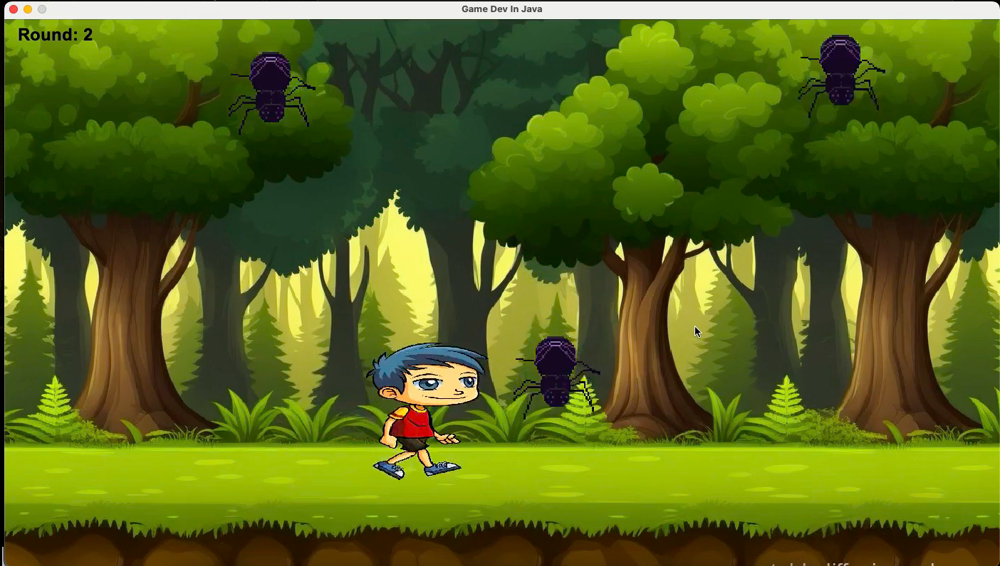
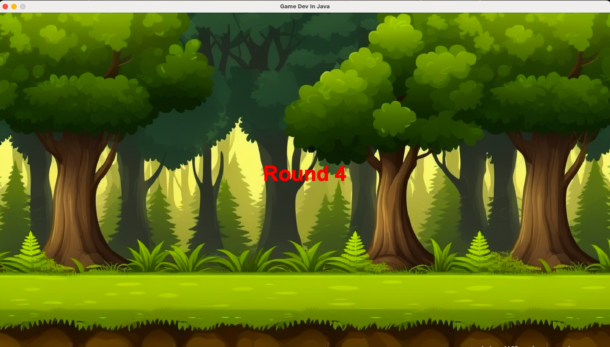
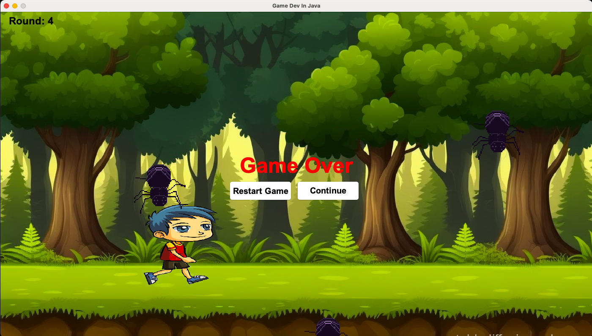

# JAVA_GAME

## Overview
This project is a 2D game developed using Java and Swing. The game involves progressing through rounds while avoiding obstacles, with increasing difficulty after each round. Players can either restart from round 1 or continue from the last round upon game over.

## Features
- **Rounds**: Players advance through multiple rounds with progressively increasing speed for added difficulty.
- **Collision Detection**: Smooth collision detection between the player and obstacles for a realistic gameplay experience.
- **Controls**: Simple keyboard controls to move the player left and right.
- **Game Over and Continue Options**: Upon losing, players have options to restart from round 1 or continue from the round they lost on.

## Learning Outcomes
Through this project, I gained hands-on experience in:
- **Java Swing for GUI Development**: Learned how to create and manage game elements, animations, and display UI components.
- **Game Logic Implementation**: Practiced implementing a game loop and handling collision detection, player movement, and score tracking.
- **Object-Oriented Design**: Structured the game using OOP principles, creating classes for player, enemy, and board elements.
- **Git and GitHub**: Gained experience in version control with Git and published the project on GitHub.

## Game Functionality
- **Player Movement**: Players can move horizontally using keyboard inputs.
- **Round Advancement**: After each round, speed increases, adding to the challenge.
- **Collision Detection**: The game detects collisions accurately, allowing for responsive gameplay.
- **End of Round and Game Over Messages**: The game displays messages to indicate when the player wins a round or loses the game.
- **Play Again Option**: Players can restart the game entirely or continue from where they left off after losing.

## How to Play
- Use the **left and right arrow keys** to control the player.
- Avoid obstacles to progress to the next round.
- You can choose to restart or continue if you lose a round.

## Screenshots
Add screenshots of the game to showcase:
1. **Gameplay** - 
    Here is what the game looks like while you're playing.
   
    
   
3. **Round Transition** -
    Below is a screenshot showing the round transition with the round number displayed.
   
    
  
5. **Game Over Screen** -
    When the game is over, the following screen is displayed. You can choose to either restart from round 1 or continue from where you left off.
   
    
